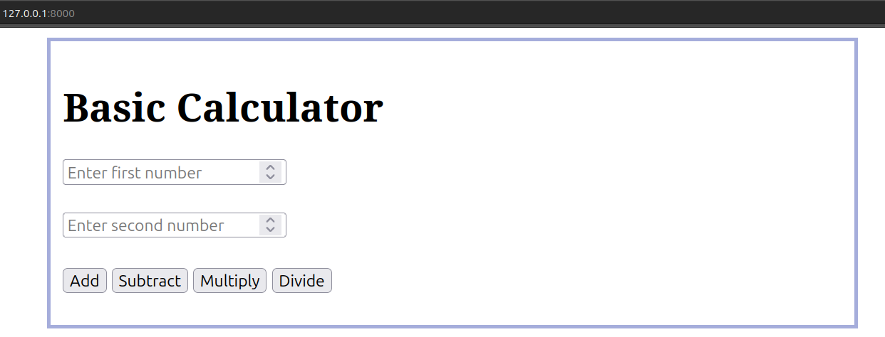
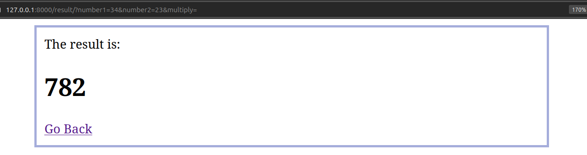

# Building a Calculator App using Django

## How Will Our Calculator App Look?

### Calculator with add, subtract, multiply, and divide operations

# [freeCodeCamp.org](https://www.freecodecamp.org/) linked to [How to create a calculator app in Django](https://www.freecodecamp.org/news/how-to-create-a-calculator-app-in-django/?fbclid=IwAR2PhULBwfLRMnlaLmWOcmJF_gQ5w8Scy2aVVoKeikNqx3JYdabhKeJN2oc)

